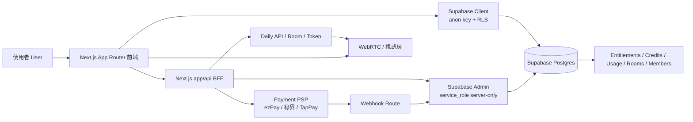
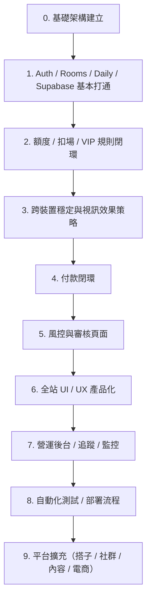

# Cowork（共工）平台總覽與 0→100 里程碑地圖

更新日期：2026-03-20  
用途：作為目前專案現況、完整網站架構、里程碑順序與「現在在哪」的單一總覽文件。

---

# 1. 先講結論

## 現在在哪
你目前已經不是「從 0 開始」，而是已經完成了 **基礎可用產品（Core MVP）** 的大半：

- 已有登入 / Rooms 列表 / 進房 / Daily private room / token 短效簽發 / Supabase 扣場規則
- 每月額度 / 免費與 VIP 規則已落地到資料表與 server route
- 背景模糊 / 虛擬背景已驗證可用
- Full-blur 也已被你打通到「遠端會跟著作用」這個層級
- 目前真正還沒完成的是：
  1. **把視訊房媒體路徑穩定收尾（尤其 desktop full-blur 的穩定性）**
  2. **金流與 VIP 付款閉環**
  3. **過審所需的站點資訊/政策頁**
  4. **全站產品化 UI / UX**
  5. **自動化與 smoke test**

---

# 2. 平台整體架構（0→100 的系統地圖）

---

# 3. 現況架構（已確認）

## 3.1 技術堆疊
- 前端/全端：Next.js App Router
- BFF：`app/api/**/route.ts`
- DB/Auth：Supabase（Postgres + Auth + RLS + SQL function）
- 視訊：Daily private room + meeting token
- 金流：目前改走 ezPay / 其他 PSP 審核路線

## 3.2 核心程式碼位置
- 登入：`app/auth/login/page.tsx`
- Rooms 列表：`app/rooms/page.tsx`
- Room 視訊頁：`app/rooms/[roomId]/page.tsx`
- 帳號狀態：`app/api/account/status/route.ts`
- 建房：`app/api/daily/create-room/route.ts`
- 簽 Daily token：`app/api/daily/meeting-token/route.ts`
- Supabase client：`lib/supabaseClient.ts`
- Supabase admin：`lib/supabaseAdmin.ts`

## 3.3 目前平台規則（已定案）
- 房型：pair / group（group max 6）
- 時長：25m / 50m
- 免費額度：每月 4 場
- 扣場規則：25m=1、50m=2、pair/group 同規則
- VIP：單一方案（目前規劃月費）

## 3.4 安全模型
- Daily 房間為 private
- token 短效且由 server 動態簽發
- 不把 tokenized URL 當永久連結保存
- 扣場 / 規則檢查在 server route + SQL function 完成

---

# 4. 視訊房目前的正確產品決策

## 4.1 Mobile / Tablet
- 以穩定加入通話為優先
- 禁用：
  - 背景模糊
  - 虛擬背景
  - 全畫面模糊
- 原因：行動瀏覽器的 video processor / canvas / WebRTC 相容性風險高，先不要為了特效拖慢里程碑

## 4.2 Desktop
- 保留完整視訊功能
- 背景模糊 / 虛擬背景正常可用
- Full-blur 視為平台差異化功能，但要以「本地與遠端都正常」為驗收標準

---

# 5. 從 0 到 100 的完整里程碑地圖

---

# 6. 里程碑拆解（含小里程碑）

## M0 — 基礎技術底座（已完成）
### 目標
把平台最基本的骨架搭起來。

### 已完成
- Next.js App Router
- Supabase Auth / Postgres / RLS
- Daily 房間建立與 token 簽發
- 本地開發環境可跑

### 驗收
- 可以本地登入、看頁面、打 API、進房間

---

## M1 — Rooms 核心流程（已完成）
### 目標
完成「登入 → 看 Rooms → 進房」的主流程。

### 已完成
- 登入 / 登出
- Rooms 列表可見
- Room 視訊頁可進入
- Daily private room 可用

### 驗收
- 使用者可正常加入房間看到視訊畫面

---

## M2 — 額度 / 權限閉環（已完成）
### 目標
讓免費額度、VIP 規則、扣場路徑真正落地。

### 已完成
- `user_entitlements`
- `cowork_monthly_usage`
- `cowork_try_consume_credits(...)`
- `/api/account/status`
- `/api/daily/meeting-token` 進房前扣場/檢查

### 驗收
- 進房前能看到本場消耗與剩餘場次
- 非法狀態不會拿到 token

---

## M3 — 跨裝置穩定（進行中，接近完成）
### 目標
把視訊房功能做成「桌機完整、手機穩定」的正式策略。

### 子里程碑
#### M3-1 Mobile 降級策略
- mobile / tablet 禁用全部 blur / virtual background / full-blur
- 保留正常進房與音視訊
- 避免手機端 effect error

#### M3-2 Desktop 視訊效果穩定
- 背景模糊 / 虛擬背景穩定
- full-blur 本地可用

#### M3-3 Desktop Full-blur 遠端驗收
- 遠端也必須看到模糊
- 避免黑屏 / source 被切死 / cleanup 殘留

### 驗收
- 手機：可正常進房、看不到模糊功能
- 桌機：背景模糊、虛擬背景、full-blur 都正常
- 桌機 full-blur：**遠端也模糊**

### 你現在的位置
**目前正在 M3-3。**

---

## M4 — 付款閉環（尚未完成）
### 目標
把 VIP 從「規則存在」變成「可以真的付費升級」。

### 子里程碑
#### M4-1 PSP 路線定案
- 確定使用 ezPay / 綠界 / TapPay / 備援方案
- 確定商家資料與網站資訊一致

#### M4-2 付款頁
- 顯示方案、價格、付款方式
- 顯示是否續費、退款/取消規則

#### M4-3 Webhook
- 驗簽
- 付款成功後更新 `user_entitlements`
- idempotency 防重複入帳

#### M4-4 前端立即生效
- `/api/account/status` 正確顯示升級後狀態
- UI 立即切換 VIP 權益

### 驗收
- 付款一次後可立即成為 VIP
- webhook 重送不會重複升級

---

## M5 — PSP 過審與風控頁面（尚未完成）
### 目標
把站點補成金流審核看得懂、看得到、比對得過的版本。

### 子里程碑
#### M5-1 一致性
- 商家名稱
- 電話
- Email
- 地址
- 客服時間
- 與金流送審資料逐字一致

#### M5-2 必備頁面
- 服務條款
- 隱私權政策
- 付款/退款/取消政策
- 客服與申訴管道
- 方案與價格
- 關於我們 / 營業資訊

#### M5-3 固定網址
- Named Tunnel / 正式網域
- 避免審核網址一直變

### 驗收
- 未登入也能看到完整站點資訊
- 可重新送審 PSP

---

## M6 — UI / UX 產品化（尚未完成）
### 目標
把目前能用但還偏工程感的介面，做成正式產品。

### 子里程碑
#### M6-1 設計系統
- 色彩、字級、間距、陰影、圓角、動效規範

#### M6-2 共用元件
- Button
- Select
- Card
- Toast
- Loading / Empty / Error states

#### M6-3 頁面產品化
- Landing
- Rooms 列表
- Room page
- Pricing
- Account

### 驗收
- 桌機/手機介面一致
- 主要操作都有一致的點擊回饋與 loading

---

## M7 — 觀測、錯誤追蹤、營運底座（尚未完成）
### 目標
避免只靠肉眼 debug，開始可觀測。

### 子里程碑
- build tag / console 標記
- Daily error / nonfatal-error / camera-error 收集
- Sentry / log 事件
- 使用者流程追蹤（登入、進房、付款成功率）

### 驗收
- 主要錯誤可追溯
- 知道問題發生在哪個裝置/瀏覽器/版本

---

## M8 — 自動化與 smoke test（尚未完成）
### 目標
在核心功能穩定後，才把自動化接上。

### 子里程碑
#### M8-1 工作流
- Codex IDE / VS Code
- 固定專案指令 / 規格文件

#### M8-2 Playwright smoke test
- login
- rooms list
- join room
- mobile blur hidden
- desktop blur toggle
- account status
- 付款 stub / webhook stub

#### M8-3 回歸測試
- 每次改 room 頁都驗證不把核心流程改壞

### 驗收
- 改版後可快速確認核心功能沒壞

---

## M9 — 平台擴充（0→100 的後半段）
### 目標
讓 Cowork 不只是單一功能，而是完整平台。

### 可選擴充模組
- 搭子 / buddy 模組
- 社群 / 論壇 / 內容系統
- 部落格 / 知識內容
- 電商 / 孤獨經濟商品
- 職業搭子 / 收費服務者模式
- 營運後台 / admin dashboard
- 推播 / 通知 / email automation

### 驗收
- 不是單純共工房，而是完整平台化產品

---

# 7. 現在在哪（視覺化）

---

# 8. 接下來的正確順序（建議）
1. **先完成 M3：桌機 Full-blur 穩定收尾，手機禁用全部模糊**
2. 再做 **M5：風控與站點資訊頁**
3. 再做 **M4：付款閉環**
4. 然後做 **M6：UI / UX 產品化**
5. 最後做 **M8：Playwright / 自動化**

> 為什麼不是先做金流？  
> 因為 PSP 不只看 webhook 技術，還看網站資訊一致性與可信度。  
> 站點資訊沒補齊，先做 webhook 也可能照樣被退。

---

# 9. 已確認 / 推測 / 風險

## 已確認
- Next.js + Supabase + Daily + BFF 是現有主架構
- Rooms / Auth / token / private room / 扣場規則已存在
- 金流目前還未形成正式閉環
- M3 是你現在最接近完成、也最該先收尾的里程碑

## 我的推測
- 你完成 M3 之後，整個專案的開發效率會明顯上升，因為 room page 不再是反覆打地鼠的高風險區
- M5 應該比 M4 更應該先做，因為它直接影響 PSP 過審成功率

## 風險與限制
- full-blur 仍屬高風險媒體功能，不應在未驗收前視為穩定完成
- PSP 過審除了技術，還看站點內容與商業可信度
- 若未來 full-blur 仍反覆不穩，必須再次評估是否要把 desktop 視訊核心與 mobile 路線進一步分流

---

# 10. 建議放進 repo 的文件
- `docs/PLATFORM_OVERVIEW.md`（本文件）
- `docs/MILESTONES.md`
- `docs/ARCHITECTURE.md`
- `docs/AGENT_PROMPTS.md`
- `docs/PSP_REVIEW_CHECKLIST.md`
